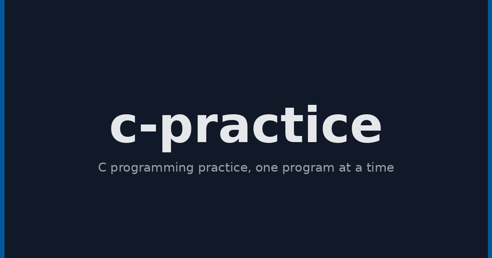

# C Practice

> A collection of C practice programs and solutions tracked as a running record of learning the language for a BCA course.




<p>
  <a href="https://www.gnu.org/software/gcc/">
    
  </a>
  <a href="https://gcc.gnu.org/">
    
  </a>
  <a href="https://code.visualstudio.com/">
    
  </a>
  <a href="LICENSE">
    
  </a>
</p>

## Why

Practice work for a BCA C programming course, kept as a running record of learning the language one program at a time.

## When

Started in September 2026.

## Tech Stack

 

- **Language:** C
- **Compiler:** GCC
- **Editor:** Visual Studio Code

## Why This Stack

- **C:** the language being learned in the course, so every program is practice in it.
- **GCC:** the standard free C compiler, available everywhere and the natural way to build plain C programs.
- **VS Code:** a lightweight editor with good C support for writing and running small programs.

## Features

- **Input and output:** `hello.c`, `printst.c`, `question.c` (printf and scanf)
- **Arithmetic programs:** `avg.c` (average), `si.c` (simple interest), `ctof.c` (Celsius to Fahrenheit), `sqrt.c` (square root)
- **Conditional logic:** `evenodd.c`, `posneg.c`, `largest.c`, `largest3num.c`, `largestoftwonumber.c`, `leapyearcheck.c`, `grades.c`, `weekdays.c` (if/else and switch)
- **Character checks:** `vorc.c` (vowel or consonant)
- **Loops:** `loop.c`, `fibbonaci.c` (Fibonacci series)
- **Swapping values:** `swap.c`, `swap2nums.c` (temp variable and arithmetic swap)

All programs currently live in the `Basics` folder. New programs and topics are added as learning continues.

## Quick Start

### Prerequisites

- A C compiler like GCC installed on your machine

### Installation

1. Clone the repository:

   ```bash
   git clone https://github.com/p3xz/c-practice.git
   ```

2. Move into the project folder:

   ```bash
   cd c-practice
   ```

3. Compile a program with GCC:

   ```bash
   gcc Basics/hello.c -o hello
   ```

4. Run it:

   ```bash
   ./hello
   ```

   On Windows, run `hello.exe` instead.

## Usage

Compile and run a program in one line:

```bash
gcc Basics/hello.c -o hello && ./hello
```

On Windows, replace `./hello` with `hello.exe`.

## Contributing

Suggestions and fixes are welcome. Open an issue or a pull request with the program and a short description of what it covers.

## License

MIT. See [LICENSE](LICENSE) for details.

## Credits

Built and maintained by [p3xz](https://github.com/p3xz) as a personal record of C programming practice.
